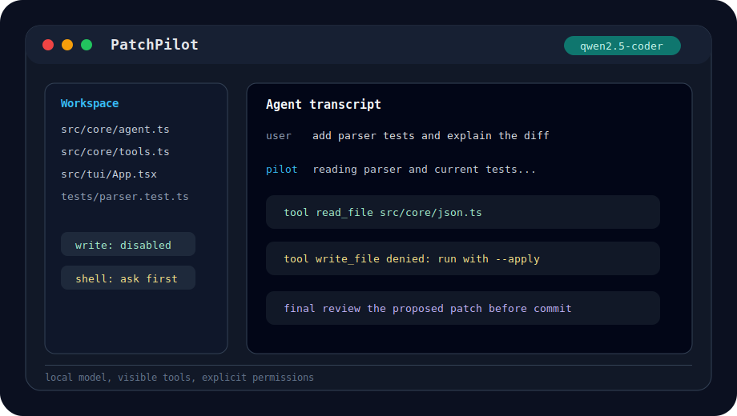

<div align="center">

# PatchPilot

**A local-first coding agent TUI for safe patching, guided setup, observable runs, provider cache telemetry, and efficient model discovery.**

[](https://github.com/jx-grxf/PatchPilot/actions/workflows/ci.yml)


[](LICENSE)

</div>

---
## Showcase

<p align="center">
  
</p>

---

# !!!Security and legal notice!!!
PatchPilot is an experimental coding agent that can read/write files and run shell commands when those capabilities are enabled. Use it only in repositories and environments you trust.

**I don't want to scare people. But I must point out that using PatchPilot involves risks and that I am not liable for any problems or damages that may arise.**

## Security notice

- **No zero-risk guarantee:** LLM-driven tooling can make incorrect or unsafe suggestions. Always review diffs and commands before applying them.
- **Sensitive data handling:** Never expose private keys, passwords, tokens, credentials, or confidential code to providers you do not fully trust.
- **Provider data flow:** Local provider (`ollama`) keeps inference on your own infrastructure. Cloud providers (`gemini`, `codex`) may process prompts and context remotely under their own terms.
- **Permission model:** Keep write and shell permissions disabled unless needed. Enable them only for the current task and disable afterward.
- **Workspace boundary:** Run PatchPilot in a dedicated project root and avoid mixing unrelated sensitive material in that workspace.
- **User responsibility:** You are responsible for reviewing, testing, and validating all generated changes before merge, deployment, or production use.

## Legal notice

- **License:** This project is provided under the [MIT License](LICENSE).
- **No warranty:** The software is provided "AS IS", without warranties of any kind, express or implied.
- **Limitation of liability:** The authors and contributors are not liable for damages, data loss, security incidents, or other consequences resulting from use or misuse.
- **Third-party services:** Use of model providers and external services is subject to their own terms, privacy policies, retention settings, and regional compliance requirements.
- **Compliance:** If you process personal, regulated, or company-restricted data, ensure your usage complies with applicable law, contracts, and internal policies.

## Responsible disclosure

If you discover a security issue, please do not publish exploit details immediately. Open a private security report via GitHub Security Advisories or contact the maintainer directly, and include reproduction steps and impact.

PatchPilot is designed for transparent, user-controlled operation, but safe usage requires deliberate permission control, careful review, and standard engineering safeguards.

---

# Enough with the legal stuff, now to the good and unique things about PatchPilot!


## Contents

- [PatchPilot](#patchpilot)
  - [Showcase](#showcase)
- [!!!Security and legal notice!!!](#security-and-legal-notice)
  - [Security notice](#security-notice)
  - [Legal notice](#legal-notice)
  - [Responsible disclosure](#responsible-disclosure)
- [Enough with the legal stuff, now to the good and unique things about PatchPilot!](#enough-with-the-legal-stuff-now-to-the-good-and-unique-things-about-patchpilot)
  - [Contents](#contents)
  - [Highlights](#highlights)
  - [Why This Exists](#why-this-exists)
  - [Current Workflow](#current-workflow)
  - [Tech Stack](#tech-stack)
  - [Requirements](#requirements)
  - [Quick Start](#quick-start)
  - [Usage](#usage)
  - [Remote Ollama](#remote-ollama)
  - [Safety Model](#safety-model)
  - [Development](#development)
  - [Roadmap](#roadmap)
  - [License](#license)

---

## Highlights

| Feature | Description |
|---|---|
| Local-first agent | Talks to an Ollama server running on your machine by default |
| Guided onboarding | Dedicated setup window for provider, auth, and model selection |
| Gemini API provider | Can switch to Gemini through `~/.patchpilot/.env` |
| OpenRouter provider | Can use OpenRouter API keys, `openrouter/auto`, searchable model lists, and `:free` model warnings |
| Codex OAuth provider | Can use your ChatGPT Plus/Pro Codex CLI login through `codex exec`, including GPT-5.5 |
| TUI workflow | Ink-powered terminal UI with transcript, telemetry, arrow-key palette, and setup wizard |
| Workspace boundary | File tools refuse to read or write outside the selected project root |
| Explicit permissions | Writes require `--apply`; shell execution requires `--allow-shell` and stays on a restricted single-command runner |
| Runtime telemetry | Header shows CPU, memory, GPU, VRAM, temperature, power, live prompt tokens, provider cache hits, estimated session cost, generation speed, and latency |
| Remote Ollama | `/connect` scans the LAN and only lists hosts that answer Ollama's `/api/version` endpoint |
| Compute target awareness | The TUI marks Ollama as local/remote and Gemini/Codex as cloud inference |
| Advisor subagents | Planner and reviewer subagents give the primary agent a short tactical brief before it starts |
| Ollama eject | `/eject` unloads the active Ollama model with `keep_alive: 0`; exit also unloads used Ollama models best-effort |
| Tool-visible loop | The model can list files, read files, search text, write files, and run commands |
| JSON agent protocol | Model responses are parsed through a typed command envelope |
| CI-ready repo | TypeScript build, tests, and GitHub Actions are included from day one |

## Why This Exists

Local LLMs are useful for coding, but most local agent experiments either feel like raw scripts or hide too much of what is happening. PatchPilot aims for the middle ground: a polished TUI that stays honest about every file read, write, search, and command.

The first target is a practical developer workflow: open a repository, describe the patch, let the local model inspect context, and keep the user in control of risky actions.

## Current Workflow

1. Start Ollama and pull a coding model such as `qwen2.5-coder:7b`.
2. Open a project directory.
3. Run PatchPilot with a task prompt.
4. Watch the agent inspect files and request tools.
5. Enable writes or shell commands only when you intentionally want them.
6. Review the resulting Git diff before committing.

---

## Tech Stack

| Layer | Technologies |
|---|---|
| Language | TypeScript, strict NodeNext ESM |
| Runtime | Node.js 22 or newer |
| TUI | Ink, React, ink-text-input |
| Agent protocol | JSON command envelope validated with Zod |
| Model providers | Ollama chat API, Gemini generateContent API, OpenRouter OpenAI-compatible API, Codex CLI OAuth backend with JSON usage telemetry |
| Tests | Vitest |
| CI | GitHub Actions |

## Requirements

- Node.js 22 or newer
- npm 10 or newer
- Git
- Ollama for local or remote model execution, a Gemini API key, an OpenRouter API key, or Codex CLI login
- A pulled local model, for example `qwen2.5-coder:7b`, PatchPilot config in `~/.patchpilot/.env`, or `codex login`

---

## Quick Start

Install dependencies:

```bash
npm install
```

Start Ollama and pull a model:

```bash
ollama pull qwen2.5-coder:7b
```

Or use guided setup:

```bash
patchpilot
```

Then open `/onboarding` or follow the first-run setup window. API keys are stored in `~/.patchpilot/.env`.

OpenRouter:

```bash
patchpilot --provider openrouter --model openrouter/auto
```

OpenRouter `:free` models are rate-limited. OpenRouter documents 20 requests/minute for free models, with daily limits depending on account credits.

Or use Codex OAuth through your ChatGPT plan:

```bash
codex login
patchpilot --provider codex --model gpt-5.5 --reasoning medium
```

Run PatchPilot in a repository:

```bash
patchpilot
```

Then type normal tasks directly into the TUI:

```text
summarize this repository
```

Use slash commands inside the TUI:

```text
/help
/onboarding
/mode build
/write on
/shell on
/provider gemini
/provider openrouter
/provider codex
/reasoning high
/model uncensored
/eject
/connect http://192.168.1.50:11434
/doctor
```

## Usage

```bash
patchpilot [task] [options]
```

| Option | Description |
|---|---|
| `--workspace <path>` | Project root the agent may inspect |
| `--provider <name>` | Model provider: `ollama`, `gemini`, `openrouter`, or `codex` |
| `--model <name>` | Model name, defaults to `qwen2.5-coder:7b`, `gemini-2.5-flash`, `openrouter/auto`, or `gpt-5.5` |
| `--ollama-url <url>` | Ollama base URL, defaults to `http://127.0.0.1:11434` |
| `--steps <count>` | Maximum agent steps before stopping |
| `--thinking <mode>` | Step budget mode: `fixed` or `adaptive` |
| `--reasoning <effort>` | Provider reasoning effort: `low`, `medium`, `high`, `xhigh`, or `adaptive` |
| `--apply` | Allows file writes inside the workspace |
| `--allow-shell` | Allows shell commands inside the workspace |
| `--no-subagents` | Disables planner/reviewer advisor calls for faster local runs |

Run diagnostics:

```bash
patchpilot doctor
```

The doctor command checks Node, Git, and the active provider. For Ollama, it checks the Ollama CLI/server and whether the selected model is pulled locally. For Gemini, it checks `GEMINI_API_KEY`, the models API, and whether the selected model is listed. For OpenRouter, it uses `OPENROUTER_API_KEY` and provider model discovery. For Codex, it checks the Codex CLI and your local ChatGPT OAuth login. Use `patchpilot doctor --provider codex` when testing Codex OAuth.

PatchPilot caches model discovery for a short TTL inside the running TUI, so normal prompts do not re-query providers every time. Run `/models` again when you intentionally want to refresh the visible list.

PatchPilot does not invent its own server-side prompt cache. It reads provider cache telemetry when the provider reports it, for example Codex cached input tokens or OpenRouter `prompt_tokens_details.cached_tokens`, then displays cache hit rate as `cached / input`.

Inside the TUI, use `/help` to see available commands. Slash-command discovery now behaves like a palette: type `/`, move with up/down, press Enter to run or fill the selected command. Permissions can be changed without restarting:

The transcript and session sidebar have internal scroll windows. With an empty prompt, use left/right to choose the sidebar or transcript, then Page Up/Page Down to scroll and Home/End to jump.

| Slash command | Description |
|---|---|
| `/help` | Show available commands |
| `/help <command>` | Explain one command, for example `/help think` or `/help model` |
| `/` | Open the interactive command palette while typing |
| `/onboarding` | Open the guided setup window for local-vs-host choice, auth, and model selection |
| `/permissions` | Show current write and shell permissions |
| `/agents on\|off` | Enable or disable planner/reviewer advisor subagents |
| `/provider ollama\|gemini\|openrouter\|codex` | Switch between Ollama, Gemini API, OpenRouter, and Codex OAuth inference |
| `/think fixed\|adaptive` | Control step budget. `fixed` uses `--steps`; `adaptive` scales simple/complex tasks within bounds |
| `/reasoning low\|medium\|high\|xhigh\|adaptive` | Set provider reasoning effort. Codex supports all listed levels; Gemini maps `xhigh` to `high`; Ollama ignores it |
| `/mode plan` | Read-only planning mode |
| `/mode build` | Implementation mode; writes and shell can be enabled |
| `/plan` | Shortcut for `/mode plan` |
| `/build` | Shortcut for `/mode build` |
| `/write on\|off` | Enable or disable workspace writes |
| `/shell on\|off` | Enable or disable shell commands |
| `/model <query>` | Search and switch the model for the current provider |
| `/models` | Refresh models for the current provider and open them in the palette |
| `/models <query\|number>` | Search or select a model from the last `/models` list |
| `/model uncensored` | Switch to `huihui_ai/qwen2.5-coder-abliterate:7b` |
| `/model default` | Switch back to `qwen2.5-coder:7b` |
| `/connect` | Auto-scan the LAN and Tailscale peers for reachable Ollama servers |
| `/connect <url>` | Connect to another Ollama host for the current session |
| `/connect <number>` | Connect to a numbered host from the `/connect` list |
| `/connect local` | Switch back to local Ollama at `127.0.0.1:11434` on non-macOS clients |
| `/eject` | Unload the current Ollama model on the active host |
| `/eject all` | Unload all Ollama models used by PatchPilot in this session plus models reported as running |
| `/hosts` | Re-scan reachable Ollama hosts |
| `/doctor` | Check Node, Git, and the active provider from inside the TUI |
| `/clear` | Clear the current transcript |
| `/exit` | Quit PatchPilot |

## Remote Ollama

PatchPilot can run the agent on one machine while using an Ollama server on another machine. This is useful when your Windows desktop has the GPU and your MacBook is where you are editing code.

At startup, the guided setup now asks whether inference should run on `This Device` or a `Remote Host`. Host mode walks through LAN/Tailscale discovery first, then fetches the host's models before letting you choose one.

By default, PatchPilot talks to Ollama at `http://127.0.0.1:11434` on macOS, Windows, and Linux. On macOS, install and start Ollama.app, pull a model, then run PatchPilot directly:

```bash
ollama pull qwen2.5-coder:7b
patchpilot
```

PatchPilot keeps file reads, file writes, shell commands, Git, and tests on the machine where the TUI runs. Only model requests go to the selected Ollama server.

When connected to a remote Ollama server, `patchpilot doctor` treats the local Ollama CLI as optional because the selected compute target is another machine. Node.js and Git are still checked locally because workspace tools still run on the client.

For Apple Silicon Macs with less memory, tune the request budget before starting PatchPilot:

```bash
PATCHPILOT_NUM_CTX=4096 PATCHPILOT_NUM_PREDICT=768 patchpilot
```

To use a stronger remote GPU host from the MacBook, switch inside the TUI:

```text
/connect
/connect 1
```

If both machines are on the same Tailscale tailnet, PatchPilot also checks Tailscale peers and MagicDNS names during `/connect` and the startup host flow. A host can be selected by Tailscale IP, MagicDNS name, or full URL.

On a Windows desktop or another remote machine, expose Ollama on the LAN:

1. Quit Ollama from the taskbar.
2. Add a user environment variable named `OLLAMA_HOST` with value `0.0.0.0:11434`.
3. Start Ollama again from the Start menu.
4. Allow inbound TCP traffic on port `11434` in the Windows firewall for your private network.

From the MacBook, run PatchPilot inside the project you want to edit and connect to the desktop:

```bash
patchpilot --ollama-url http://<windows-pc-ip>:11434
```

Or switch inside the TUI from any supported platform:

```text
/connect
/connect 1
/connect http://<windows-pc-ip>:11434
/connect local
```

The scan verifies `GET /api/version`, so it does not list random local interfaces or machines that merely have port `11434` open. When connected, the header/sidebar switch to the selected host's device name, route, version, and model inventory instead of showing the client machine as the compute target.

## Safety Model

PatchPilot is designed to make local execution boring in the best way:

- File access is constrained to a single workspace root.
- Secret-like files such as `.env`, `.npmrc`, SSH keys, and `.netrc` are blocked from normal file tools.
- Write tools are disabled unless `--apply` is set.
- Shell tools are disabled unless `--allow-shell` is set.
- Shell commands are restricted to simple single commands with blocked metacharacters, interpreters, absolute paths, and `..` traversal.
- Provider config is stored in `~/.patchpilot/config.env`, not in the current repository by default.
- Tool output is fed back into the agent in clipped form instead of hidden from the user.
- The TUI surfaces CPU, memory, GPU utilization, VRAM, temperature, power draw, live prompt tokens, token counts, Codex cache hits, estimated session cost, token throughput, and request latency.

Codex OAuth runs `codex exec --json` and reads the CLI's `turn.completed.usage` event, including cached input tokens. Session cost is an estimate based on public API token pricing where available; actual ChatGPT-plan quota behavior is controlled by Codex/ChatGPT plan limits.

This does not make local or cloud-backed agents harmless. Review diffs before committing, and do not point remote providers at repositories containing secrets you would not intentionally send off-box.

## Development

Run the development TUI:

```bash
npm run dev -- "summarize this repository"
```

Typecheck:

```bash
npm run typecheck
```

Run tests:

```bash
npm test
```

If Vitest fails locally because a native optional dependency was installed incorrectly, run `npm ci` again before debugging PatchPilot itself.

Build:

```bash
npm run build
```

## Roadmap

| Area | Planned Work |
|---|---|
| Patch review | Rich diff preview before writes |
| Permissions | Interactive approve/deny prompts per risky tool call |
| Agents | Dedicated editor and test-runner roles with hard tool boundaries |
| Memory | Repository summaries and local task state |
| Model support | Native Ollama tool-calling when model support is reliable |
| Distribution | Tauri shell with PatchPilot CLI sidecar for signed macOS and Windows releases |
| Efficiency | Token-caching for better performance |

## License

PatchPilot is released under the [MIT License](LICENSE).
