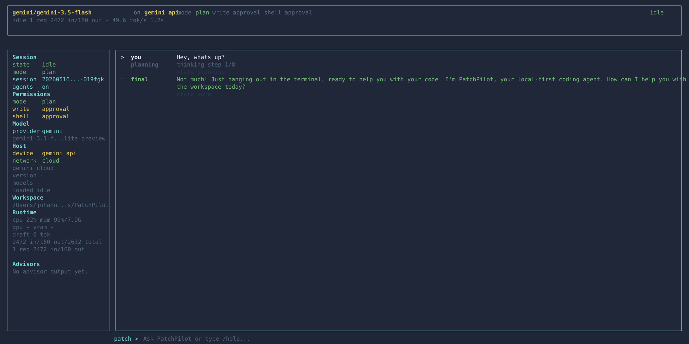

<div align="center">


# PatchPilot

**A local-first coding-agent TUI that makes repo changes visible, permissioned, and easy to review across local, remote, and cloud model routes.**

[](https://github.com/jx-grxf/PatchPilot/actions/workflows/ci.yml)
[](https://www.npmjs.com/package/@jx-grxf/patchpilot)
[](https://www.npmjs.com/package/@jx-grxf/patchpilot)


[](LICENSE)

<p>
  <strong>Visible tools.</strong> Explicit permissions. Local Ollama. Remote Ollama. Gemini. Gemini-Wrapper. OpenRouter. NVIDIA. Codex.
</p>

</div>

---

## Product Visual

<p align="center">
  
</p>

## Current TUI Screenshot

<p align="center">
  
</p>

PatchPilot is a terminal interface for running coding-agent tasks inside a repository. It shows what the agent is doing, keeps risky actions behind explicit permissions, and supports local Ollama, remote Ollama, Google Gemini, experimental Gemini Web wrapper routing, OpenRouter, NVIDIA NIM-compatible endpoints, and Codex CLI OAuth.

> [!IMPORTANT]
> PatchPilot v1.2.0 is the large agent-hardening release: default fullscreen shell, context compaction, composable ultra modes, safer shell approvals, first-run risk acceptance, Windows fixes, and refreshed npm dependencies.

---

## Contents

- [Highlights](#highlights)
- [Why This Exists](#why-this-exists)
- [Current Workflow](#current-workflow)
- [Requirements](#requirements)
- [Quick Start](#quick-start)
- [Usage](#usage)
- [Providers](#providers)
- [Remote Ollama](#remote-ollama)
- [Safety Model](#safety-model)
- [Tech Stack](#tech-stack)
- [Development](#development)
- [Roadmap](#roadmap)
- [Release Notes](#release-notes)
- [Security and Legal](#security-and-legal)
- [License](#license)

## Highlights

| Feature | What it means |
|---|---|
| Local-first by default | Uses Ollama on your own machine unless you choose another route. |
| Fullscreen shell | A Claude-Code / Codex-CLI-style TUI: compact header, scrolling transcript, command palette, animated run status, artifacts, and a bottom-pinned composer. `/theme` switches between the new shell and the legacy layout. |
| Remote GPU workflow | Connect your laptop TUI to an Ollama host on a desktop, LAN, or Tailscale machine. |
| Cloud provider routes | Gemini, Gemini-Wrapper, OpenRouter, NVIDIA, and Codex CLI OAuth are available from one TUI. |
| Guided onboarding | First-run setup walks through local/remote mode, provider auth, host discovery, model choice, defaults, and risk acceptance. |
| Observable agent loop | Transcript, tool calls, telemetry, token counts, provider cache hits, latency, and cost estimates are visible. |
| Document attachments | Paste a path to an image, PDF, or DOCX and it becomes an attachment chip; an artifacts bar lists what you attached and what PatchPilot created. |
| Composable ultra modes | Type `ultramaxx`, `ultrafast`, `ultracheap`, `ultrafocus:<path>`, or `ultraloop` in a prompt to tune effort, speed, scope, and self-review. |
| Context compaction | `/context` and `/compact` keep long sessions usable by storing and summarizing workspace context. |
| Saved-cost counter | The gemini-wrapper route is free; the header shows what the same tokens would have cost on the paid Gemini API. |
| Explicit permissions | Risky tools show a sticky approval box unless trusted bypass is explicitly accepted; high-risk shell syntax still asks in bypass. |
| Workspace boundary | File tools are constrained to the selected project root and block common secret files. |
| Slash-command palette | Type `/` for browsable commands, provider switching, modes, models, diagnostics, and host selection. |
| Advisor subagents | Explorer, planner, and reviewer advisor calls can brief the main agent before it edits. |
| Windows-ready paths | Clipboard paste, attachments, Codex CLI resolution, and Gemini-Wrapper bootstrap paths handle Windows launchers and separators. |
| Ollama eject | `/eject` unloads the active Ollama model; `/eject all` clears models PatchPilot used in the session. |
| CI-ready TypeScript | Strict TypeScript, Vitest, GitHub Actions, and package verification are included. |

## Interface

PatchPilot ships two interfaces. The **experimental shell** is the default: a
fullscreen layout with a compact header, a real scrolling transcript, a
bottom-pinned multiline composer, a categorized command palette, and animated
run status. The **legacy** layout keeps the original sidebar split-pane TUI.
Switch any time with `/theme` (or `/theme new` / `/theme legacy`) — the choice
is remembered.

Useful keys: `tab` cycles plan → build → build+bypass, `/` opens the command
palette, `←/→` move the cursor inside the composer, `shift+enter` inserts a
newline, and `esc` stops a running task.

## Why This Exists

Most local coding-agent experiments fall into one of two traps: they are either raw scripts that feel painful to use, or polished tools that hide too much of what is happening. PatchPilot aims for the middle: a practical TUI where every file read, search, proposed write, command, model route, and token/cost signal stays visible.

## Current Workflow

The core workflow is intentionally simple:

1. Open a repository.
2. Pick local, remote, or cloud inference.
3. Ask for a patch, review, summary, or refactor plan.
4. Approve writes or shell commands only when the current task needs them.
5. Review `/diff`, run tests, then commit manually.

Mode behavior is intentionally explicit: `plan` is read-only, `build` keeps writes and shell behind approval prompts, and `build+bypass` enables write and shell permissions only after a visible warning is accepted in the TUI.

## Requirements

| Requirement | Notes |
|---|---|
| Node.js 22 or newer | Required for the published CLI and source builds. |
| Git | Required for repository context and normal development workflows. |
| Ollama | Optional, only needed for local or remote Ollama inference. |
| Provider API key | Optional, only needed for Gemini, Gemini-Wrapper remote URLs, OpenRouter, or NVIDIA routes. |
| Codex CLI login | Optional, only needed for the Codex provider route. |

## Quick Start

Install the public CLI globally:

```bash
npm install -g @jx-grxf/patchpilot
```

Verify the installed CLI:

```bash
patchpilot --version
patchpilot doctor --provider ollama
```

For source development, clone it, install dependencies, build it, and link the local CLI:

```bash
git clone https://github.com/jx-grxf/PatchPilot.git
cd PatchPilot
npm ci
npm run typecheck
npm test
npm run build
node dist/cli.js --version
npm pack --dry-run
npm link
```

For local Ollama inference:

```bash
ollama pull qwen2.5-coder:7b
patchpilot
```

Then type a task inside the TUI:

```text
summarize this repository and point out the riskiest files
```

For a one-shot task from a different repository:

```bash
cd /path/to/your/project
patchpilot "find likely test gaps in this repo"
```

Use bypass permissions only when you intentionally want PatchPilot to modify files or run commands without per-tool approval:

> [!WARNING]
> `--apply --allow-shell` bypasses per-tool approval. Use it only in trusted workspaces and review `/diff` before committing.

```bash
patchpilot "add tests for the parser" --apply --allow-shell
```

API keys are stored by onboarding in `~/.patchpilot/.env`.

On first launch, PatchPilot opens guided setup for provider choice, API-key storage, host discovery, and model selection. Setup includes a discreet use-at-your-own-risk acceptance step. Press Escape to leave setup, or run `/onboarding` later to reopen it.

## Usage

```bash
patchpilot [task] [options]
patchpilot doctor [options]
patchpilot sessions [--workspace <path>]
patchpilot resume [session-id] [--workspace <path>]
```

| Option | Description |
|---|---|
| `--workspace <path>` | Project root the agent may inspect. Defaults to the current directory. |
| `--provider <name>` | Model provider route. Supports `ollama`, `gemini`/`google`, `gemini-wrapper`/`geminiwrapper`, `openrouter`/`open-router`, `nvidia`/`nim`, and `codex`/`openai`/`openai-codex`. |
| `--model <name>` | Model name for the selected provider. |
| `--ollama-url <url>` | Ollama base URL. Defaults to `http://127.0.0.1:11434`. |
| `--steps <count>` | Maximum agent loop steps before stopping. |
| `--thinking <mode>` | Step-budget mode: `fixed` or `adaptive`. Defaults to `adaptive`. |
| `--reasoning <effort>` | Provider reasoning effort: `none`, `low`, `medium`, `high`, `xhigh`, or `adaptive`. Unsupported provider/model combinations fall back to provider defaults. |
| `--apply` | Allows file writes inside the workspace. |
| `--allow-shell` | Allows shell commands inside the workspace. |
| `--subagents` | Enables explorer/planner/reviewer advisor calls. Defaults to off. |
| `--no-subagents` | Disables explorer/planner/reviewer advisor calls. |

Useful slash commands inside the TUI:

| Command | Description |
|---|---|
| `/help` | Show available commands. |
| `/help <command>` | Explain one command, for example `/help think` or `/help model`. |
| `/onboarding` | Open guided local/remote provider, auth, and model setup. |
| `/mode plan` | Read-only planning mode. |
| `/mode build` | Implementation mode; writes, scripts, tests, and shell require per-tool approval. |
| `/think fixed\|adaptive` | Switch between fixed and adaptive step budgets. |
| `/reasoning none\|low\|medium\|high\|xhigh\|adaptive` | Set provider reasoning effort where supported. |
| `/write on\|off` | Requests trusted bypass for direct writes, or returns to approval-gated build mode. |
| `/shell on\|off` | Requests trusted bypass for direct shell commands, or returns to approval-gated build mode. |
| `/agents on\|off` | Enable or disable advisor subagents. |
| `/provider ollama\|gemini\|gemini-wrapper\|openrouter\|nvidia\|codex` | Switch inference provider. |
| `/model <query>` | Search and switch the model for the current provider. |
| `/models [query\|number]` | Refresh, search, browse, or select provider models. |
| `/connect` | Scan LAN/Tailscale for reachable Ollama hosts. |
| `/connect <url>` | Connect to a specific Ollama host. |
| `/eject [model\|all]` | Unload Ollama model(s) from the active host. |
| `/hosts` | Re-scan reachable Ollama hosts. |
| `/doctor` | Run provider diagnostics from inside the TUI. |
| `/doctor fix` | Apply safe doctor repairs, such as installing the managed Gemini-API bridge. |
| `/cleanup cache\|sessions\|temp\|all` | Clean PatchPilot workspace state. |
| `/experimental` | Open the experimental checkbox menu; use Space to toggle file-analysis, memory, subagents, and shell-metacharacters. |
| `/init` | Ask the selected model to inspect the repository and create or update `PATCHPILOT.md`. |
| `/new` | Start a fresh session and clear current context. |
| `/sessions` | List recent sessions for the current workspace. |
| `/resume [session-id]` | Resume a previous session and inject its compact summary into the next run. |
| `/diff` | Show the current Git diff. |
| `/approve once\|session` | Approve a pending risky tool request. |
| `/deny` | Deny a pending risky tool request. |
| `/clear` | Clear the current transcript. |
| `/exit` | Quit PatchPilot. |

The transcript and sidebar have internal scroll areas. With an empty prompt, use left/right to choose the sidebar or transcript, then Page Up/Page Down and Home/End to navigate long sessions.

The TUI also keeps a live todo panel in the lower transcript area. Providers can update it through the provider-neutral `update_todo` tool, so longer runs show the current task, pending work, and completed checkpoints without hiding the chat transcript.

Experimental file analysis allows `inspect_document` to read supported files outside the workspace after per-path approval when the user provides an absolute path. With Gemini-Wrapper's managed Python bridge, PatchPilot sends PNG/JPEG/WebP/GIF/HEIC images to Gemini Web as file inputs for visual analysis and text extraction. PDFs and DOCX files use local text extraction first, then fall back to Gemini-Wrapper only when local extraction cannot produce useful text. Image OCR remains explicit through `mode:"ocr"`/`mode:"local"`. Experimental memory stores durable workspace notes in `~/.patchpilot/memory.sqlite`; `memory_remember` requires write approval and `memory_search` is read-only. Experimental shell-metacharacters allow `run_shell` to use pipes, `&&`, and `;`; redirects, shell expansion, background jobs, OR chains, and multiline commands still require explicit approval even in build+bypass.

## Providers

| Provider route | Accepted values | Default model | Best for | Setup |
|---|---|---|---|---|
| Ollama local | `ollama` | `qwen2.5-coder:7b` | Private local coding work and offline experiments. | Install Ollama, pull a model, run `patchpilot`. |
| Ollama remote | `ollama` with `--ollama-url` or `/connect` | Host model inventory | Laptop editing with a stronger desktop/server GPU. | Expose Ollama on the host, then use `/connect` or `--ollama-url`. |
| Google Gemini | `gemini`, `google` | `gemini-3.5-flash` | Fast cloud inference through a Gemini API key. | Store `GEMINI_API_KEY` in `~/.patchpilot/.env` or use onboarding. |
| Gemini-Wrapper | `gemini-wrapper`, `geminiwrapper` | `auto` | Advanced, unofficial opt-in bridge to the pinned `gemini_webapi` Python wrapper, with optional HTTP-wrapper mode. | Read [docs/gemini-wrapper.md](docs/gemini-wrapper.md), use onboarding to paste `__Secure-1PSID`, then run `/doctor fix` to approve the pinned managed bridge install. PatchPilot creates `~/.patchpilot/gemini-cookies.json`, exposes `auto`, `flash-lite`, `flash`, and `pro` shortcuts, asks the WebAPI for real available model descriptors, and never scans browser cookies. |
| OpenRouter | `openrouter`, `open-router` | `openrouter/auto` | Broad model routing, auto model selection, and free variants. | Store `OPENROUTER_API_KEY` in `~/.patchpilot/.env` or use onboarding. |
| NVIDIA | `nvidia`, `nim` | `meta/llama-3.1-70b-instruct` | NVIDIA NIM OpenAI-compatible endpoints. | Store `NVIDIA_API_KEY` in `~/.patchpilot/.env` or use onboarding. |
| Codex CLI | `codex`, `openai`, `openai-codex` | `gpt-5.5` | Using an existing Codex CLI OAuth login. | Run `codex login`, then `patchpilot --provider codex`. |

Examples:

```bash
patchpilot --provider ollama --model qwen2.5-coder:7b
patchpilot --provider gemini --model gemini-3.5-flash
patchpilot --provider gemini-wrapper --model auto
patchpilot --provider gemini-wrapper --model flash-lite
patchpilot --provider gemini-wrapper --model flash
patchpilot --provider gemini-wrapper --model pro
patchpilot --provider openrouter --model openrouter/auto
patchpilot --provider nvidia --model meta/llama-3.1-70b-instruct
patchpilot --provider codex --model gpt-5.5
patchpilot --provider google --model gemini-3.5-flash
patchpilot --provider nim --model meta/llama-3.1-70b-instruct
patchpilot --provider openai --model gpt-5.5
```

Provider diagnostics:

```bash
patchpilot doctor --provider ollama
patchpilot doctor --provider gemini
patchpilot doctor --provider gemini-wrapper
patchpilot doctor --provider openrouter
patchpilot doctor --provider nvidia
patchpilot doctor --provider codex
```

PatchPilot caches model discovery for a short TTL inside the running TUI, so normal prompts do not re-query providers every time. Run `/models` again when you intentionally want to refresh the visible list.

PatchPilot reads provider cache telemetry when the provider reports it, for example Codex cached input tokens or OpenRouter `prompt_tokens_details.cached_tokens`, then displays cache hit rate as `cached / input`.

Reasoning support is provider and model dependent. Codex accepts fixed reasoning levels. OpenRouter receives `reasoning.effort` only for models whose metadata advertises reasoning support. Gemini uses Thinking configuration where the selected model exposes it; some Gemini models cannot disable thinking. Gemini-Wrapper exposes Gemini Web model shortcuts through live `gemini_webapi` discovery: `flash-lite`, `flash`, and `pro` resolve to the currently listed Web model IDs, while `thinking` remains a legacy compatibility alias only. The wrapper does not expose Gemini Web Denkaufwand as a stable `/reasoning` control yet. Ollama only receives native `think` values for known thinking model families. NVIDIA reasoning effort is limited to supported GPT-OSS NIM routes.

Gemini-Wrapper is intentionally explicit and unofficial. In default `python` bridge mode, PatchPilot creates a managed Python venv and installs the pinned wrapper there only after `/doctor fix` or `patchpilot doctor --fix` approval:

> [!CAUTION]
> `__Secure-1PSID` acts like a Google session token. Never paste it into issues, logs, chats, or commits.

```sh
~/.patchpilot/gemini-wrapper-venv
```

This avoids Homebrew Python's externally-managed-environment / PEP 668 block. Then PatchPilot runs the bridge command itself for model discovery and chat requests. Use `/onboarding`, choose Gemini-Wrapper, paste `__Secure-1PSID`, and optionally paste `__Secure-1PSIDTS`. PatchPilot writes `~/.patchpilot/gemini-cookies.json` with owner-only permissions and stores the file path in `~/.patchpilot/.env`.

```sh
PATCHPILOT_PROVIDER=gemini-wrapper
PATCHPILOT_MODEL=auto
PATCHPILOT_GEMINI_WRAPPER_MODE=python
PATCHPILOT_GEMINI_WRAPPER_COOKIES_JSON=/Users/you/.patchpilot/gemini-cookies.json
PATCHPILOT_GEMINI_WRAPPER_MIN_INTERVAL_MS=1500
PATCHPILOT_GEMINI_WRAPPER_TIMEOUT_MS=180000
```

The cookie JSON must contain `__Secure-1PSID`; `__Secure-1PSIDTS` is optional for some accounts. If the optional timestamp expires, PatchPilot retries once without it. Transient WebAPI network timeouts are retried inside the bridge. `auto` lets Gemini Web pick its default model and avoids relying on brittle Web model headers. `flash-lite`, `flash`, and `pro` are PatchPilot shortcuts resolved from live Gemini Web model descriptors; `thinking` is kept only for legacy sessions. In Python bridge mode, `inspect_document` passes supported files through `gemini_webapi` so Gemini Web can analyze screenshots, images, PDFs, and DOCX files directly. Env alternatives are `GEMINI_SECURE_1PSID` and `GEMINI_SECURE_1PSIDTS`. See [docs/gemini-wrapper.md](docs/gemini-wrapper.md) for the exact setup steps.

PatchPilot also sets `GEMINI_COOKIE_PATH` to `~/.patchpilot/gemini-webapi-cache` for the Python process so refreshed wrapper cookies stay in a local owner-only cache instead of a temporary directory.

PatchPilot does not inspect Chrome, Safari, Firefox, Arc, Edge, Brave, Keychain, or browser cookie stores, and it does not reuse Google web-login sessions automatically. Advanced users can still set `PATCHPILOT_GEMINI_WRAPPER_MODE=http` plus `PATCHPILOT_GEMINI_WRAPPER_BASE_URL` for an explicit OpenAI-compatible `/v1` endpoint.

OpenRouter `:free` models are rate-limited by OpenRouter. PatchPilot warns when a selected model ID ends in `:free`, and OpenRouter credit or rate-limit failures are surfaced as explicit provider errors.

## Remote Ollama

PatchPilot can run the TUI and workspace tools on one machine while sending model requests to Ollama on another machine. This is useful when your desktop has the GPU and your laptop is where you edit code.

The guided setup can choose between `This Device` and `Remote Host`. Remote host setup checks LAN and Tailscale candidates first, then fetches the selected host's models before prompting for a model.

Inside PatchPilot:

```text
/connect
/connect 1
/connect http://192.168.1.50:11434
/connect local
```

If both machines are on the same Tailscale tailnet, PatchPilot also checks Tailscale peers and MagicDNS names during `/connect` and the startup host flow. A host can be selected by Tailscale IP, MagicDNS name, or full URL.

From the shell:

```bash
patchpilot --ollama-url http://<host-ip>:11434
```

On a Windows desktop or remote host, expose Ollama on your private network:

1. Quit Ollama.
2. Set `OLLAMA_HOST` to `0.0.0.0:11434`.
3. Start Ollama again.
4. Allow inbound TCP traffic on port `11434` only on trusted private networks.

PatchPilot verifies candidates with Ollama's `/api/version` endpoint before listing them. When connected, the header/sidebar switch to the selected host's device name, route, version, and model inventory instead of showing the client machine as the compute target. It does not move file reads, writes, Git, or test commands to the remote host; only model requests are routed there.

For smaller local machines, reduce the request budget before starting PatchPilot:

```bash
PATCHPILOT_NUM_CTX=4096 PATCHPILOT_NUM_PREDICT=768 patchpilot
```

## Safety Model

PatchPilot is designed to keep powerful actions boring and reviewable:

- File access is constrained to one workspace root.
- Secret-like files such as `.env`, `.envrc`, `.npmrc`, `.netrc`, SSH keys, PEM/key/cert bundles, and credential files are blocked from normal file tools.
- Writes are blocked by default; in the TUI, risky write tools request approval, and `--apply` keeps the legacy always-allow write path.
- Shell commands are blocked by default; dedicated script/test tools request approval and show the package script body before running. `--allow-shell` keeps the legacy always-allow shell path.
- Shell execution uses a restricted runner. Pipes are supported; `&&` and `;` require `/experimental shell-metacharacters`, and higher-risk shell syntax remains approval-gated even in build+bypass.
- Provider config is stored in `~/.patchpilot/.env`, not in the current repository by default.
- Session logs are stored as append-only JSONL in `.patchpilot/sessions/`; that folder is gitignored. A global index in `~/.patchpilot/session-index.json` powers `patchpilot sessions` and `/resume`.
- Tool output is shown in the transcript and fed back into the agent in clipped form.
- Cloud providers may process prompts and context remotely under their own terms.

This is still experimental agent tooling. Review diffs, avoid sensitive repositories when using cloud providers, and do not enable write or shell permissions casually.

Safe patch workflow:

```text
/mode plan
ask PatchPilot to inspect and propose the change
/mode build
approve only the specific write/test requests you expect
/diff
run tests
commit manually with git
```

PatchPilot now has sticky approval prompts and a Git diff command, but it still does not replace human review. Inline rich diff review, real context resume, and commit/PR automation remain future work.

## Tech Stack

| Layer | Technologies |
|---|---|
| Language | TypeScript, strict NodeNext ESM |
| Runtime | Node.js 22+ |
| TUI | Ink, React, ink-text-input |
| Agent protocol | JSON command envelope validated with Zod |
| Sessions | Append-only JSONL in `.patchpilot/sessions` plus global index in `~/.patchpilot` |
| Providers | Ollama chat API, Gemini generateContent API, Gemini-Wrapper OpenAI-compatible API, OpenRouter OpenAI-compatible API, NVIDIA OpenAI-compatible API, Codex CLI OAuth backend |
| Tests | Vitest |
| CI | GitHub Actions |

More detail: [docs/architecture.md](docs/architecture.md)

## Development

Run the TUI from source:

```bash
npm run dev -- "summarize this repository"
```

Typecheck, test, and build:

```bash
npm run typecheck
npm test
npm run build
```

If Vitest fails because a native optional dependency was installed incorrectly, run `npm ci` again before debugging PatchPilot itself.

## Roadmap

| Area | Planned work |
|---|---|
| Patch review | Rich diff preview before writes. |
| Permissions | Per-tool approval exists; richer previews and persisted policies are next. |
| Agents | Dedicated editor and test-runner roles with hard tool boundaries. |
| Memory | Deeper resume that restores full transcript context, not just session summaries. |
| Model support | Native Ollama tool calling when model support is reliable. |
| Distribution | Signed macOS and Windows desktop shell with the CLI as a sidecar. |
| Efficiency | More token-cache-aware prompts and provider-specific cost reporting. |

## Release Notes

Release notes are kept in [docs/releases](docs/releases).

| Version | Notes |
|---|---|
| `v1.2.0` | [Release notes](docs/releases/v1.2.0.md) |
| `v1.1.0` | [Release notes](docs/releases/v1.1.0.md) |
| `v1.0.1` | [Release notes](docs/releases/v1.0.1.md) |
| `v1.0.0` | [Release notes](docs/releases/v1.0.0.md) |
| `v0.4.0` | [Release notes](docs/releases/v0.4.0.md) |
| `v0.3.1-beta` | [Release notes](docs/releases/v0.3.1-beta.md) |
| `v0.3.0` | [Release notes](docs/releases/v0.3.0.md) |
| `v0.2.1` | [Release notes](docs/releases/v0.2.1.md) |
| `v0.2.0` | [Release notes](docs/releases/v0.2.0.md) |
| `v0.1.0` | [Release notes](docs/releases/v0.1.0.md) |

## Security and Legal

PatchPilot can read files, write files, and run shell commands when you enable those capabilities. Use it only in repositories and environments you trust. You use PatchPilot at your own risk; the maintainer accepts no liability for actions you approve, bypass, or run from generated output.

- Security policy: see [SECURITY.md](SECURITY.md).
- Security reports: please use GitHub Security Advisories or contact the maintainer privately with reproduction steps and impact.
- License: this project is provided under the [MIT License](LICENSE).
- Warranty: the software is provided "AS IS", without warranties of any kind.
- Third-party services: model providers and external services are subject to their own terms, privacy policies, retention settings, and regional compliance requirements.

## License

PatchPilot is released under the [MIT License](LICENSE).
